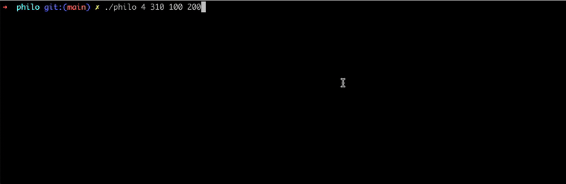

## 🍝 Philosophers


This project simulates the **Dining Philosophers Problem** using C with threads (mandatory) and processes (bonus).
---

### ✅ Features

* Threads & mutexes (mandatory)
* Processes & semaphores (bonus)
* Deadlock and starvation prevention
* Precise timing for eating, sleeping, and dying

---

### 🔧 Usage

#### Compile

```bash
cd philo        # or philo_bonus
make
```

#### Run Example

```bash
./philo 4 310 100 200
```


#### Arguments

```
[number_of_philosophers]        → how many philosophers (and forks)
[time_to_die]                   → time (ms) before a philosopher dies without eating
[time_to_eat]                   → time (ms) it takes to eat
[time_to_sleep]                 → time (ms) it takes to sleep
[number_of_times_each_must_eat] → (optional) simulation ends when all eat this many times
```

**Example:**

```bash
./philo 5 800 200 200 3
```

* 5 philosophers
* Die if they don't eat in 800ms
* Eat for 200ms
* Sleep for 200ms
* Simulation stops when each philosopher eats 3 times

---

### 📁 Structure

```
philo/        # Mandatory version with threads
philo_bonus/  # Bonus version with processes
```

---

Let me know if you'd like this in Arabic or French too.
